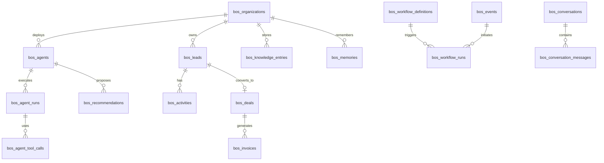

# Business OS — Software Architecture Blueprint

**Status:** Platform v0.1 · All sprints scaffolded  
**Audience:** Engineering, product, founders  
**Principle:** Don't build software modules. Build **AI employees**.

> **Implementation:** See `apps/business-os/`, `services/api/src/modules/business-os/`, migration `026_bos_platform.sql`.

This document is the blueprint to implement before writing the first customer-facing Business OS feature. It aligns the landing-page vision with the existing Curvvtech monorepo (Express API, Postgres, FollowUp SaaS, internal Curvvtech OS admin).

---

## 1. Vision & product boundary

### What Business OS is

An **AI-native operating system for businesses** where customers hire AI employees instead of buying disconnected SaaS tools.

| Traditional stack | Business OS stack |
|---|---|
| CRM + ERP + HRMS + Accounting | AI Sales Employee, AI Finance Employee, AI HR Employee… |
| Data siloed per product | One **Business Brain** shared by all agents |
| User navigates modules | User receives briefings, approvals, and outcomes |

### What Business OS is not (Phase 1–2)

- Not a full ERP on day one (no Odoo-style module explosion)
- Not a rewrite of Curvvtech's internal admin (`/api/admin/*`) for external customers
- Not "AI chat bolted onto CRM" — agents are first-class entities

### Relationship to existing code

| Asset | Today | Role in Business OS |
|---|---|---|
| `apps/website` `/business-os` | Marketing landing | Stays; links to product app |
| `apps/admin` | Curvvtech internal OS | Reference UX; **not** the customer product |
| `services/api` `/api/admin/*` | Internal CRM/finance/projects | Patterns to reuse; separate tenant model |
| FollowUp (`/api/v1/*`) | WhatsApp CRM SaaS | Communication layer + lead capture patterns |
| `013–025` migrations | Curvvtech OS tables | Inspiration; new `bos_*` schema for product |

---

## 2. Architectural north star

Agents sit **above** knowledge domains, not beside them.

```
                    ┌─────────────────────┐
                    │    Business Brain    │
                    │  (memory + context)  │
                    └──────────┬──────────┘
                               │
         ┌─────────────────────┼─────────────────────┐
         │                     │                     │
   ┌─────▼─────┐        ┌──────▼──────┐       ┌──────▼──────┐
   │Sales Agent│        │Finance Agent│       │  HR Agent   │  …
   └─────┬─────┘        └──────┬──────┘       └──────┬──────┘
         │                     │                     │
         └─────────────────────┼─────────────────────┘
                               │
                    ┌──────────▼──────────┐
                    │  Knowledge Domains   │
                    │ CRM · Finance · HR · │
                    │ Inventory · Projects │
                    └──────────┬──────────┘
                               │
                    ┌──────────▼──────────┐
                    │  Workflow + Events   │
                    └─────────────────────┘
```

**Decision rule for every feature:**

> Which AI employee needs this capability to do their job?

If no agent owns it, defer or fold it into Business Brain infrastructure.

---

## 3. Platform layers

```
Business OS Platform
│
├── Identity          — orgs, users, roles, teams, branches
├── Business Brain    — unified knowledge + semantic retrieval
├── Memory Engine     — structured + vector memory per org
├── Agent Runtime     — agent definitions, tools, goals, permissions
├── Workflow Engine   — event-driven process orchestration
├── Communication     — email, WhatsApp, in-app, notifications
├── Integrations      — Meta, Google Ads, Razorpay, accounting APIs
├── Automation Engine — rules, schedules, triggers
├── Analytics Engine  — metrics, CEO briefings, recommendations
└── Marketplace       — (Phase 4+) third-party agents & integrations
```

Knowledge domains (CRM, Finance, HR, etc.) are **data + APIs** consumed by agents — never the top-level navigation metaphor for customers.

---

## 4. Recommended monorepo structure

Keep one repo. Add a dedicated product surface; do not overload `apps/admin`.

```
/
├── apps/
│   ├── website/                 # Marketing (existing)
│   ├── business-os/             # NEW — customer product (Next.js 15+)
│   │   ├── app/
│   │   │   ├── (auth)/
│   │   │   ├── (platform)/
│   │   │   │   ├── dashboard/           # CEO Command Center shell
│   │   │   │   ├── agents/              # Agent roster + detail
│   │   │   │   ├── brain/               # Business Brain explorer
│   │   │   │   ├── workflows/
│   │   │   │   ├── conversations/
│   │   │   │   └── settings/
│   │   │   └── api/                     # BFF routes if needed
│   │   ├── components/
│   │   │   ├── agents/
│   │   │   ├── command-center/
│   │   │   ├── brain/
│   │   │   └── workflows/
│   │   └── lib/
│   │       ├── api-client.ts
│   │       └── agent-types.ts
│   ├── admin/                   # Curvvtech internal (unchanged)
│   └── followup-web/            # FollowUp product (unchanged)
│
├── services/
│   ├── api/                     # Unified backend (extend, don't fork yet)
│   │   └── src/modules/
│   │       ├── business-os/     # NEW namespace — all BOS product logic
│   │       │   ├── identity/
│   │       │   ├── brain/
│   │       │   ├── agents/
│   │       │   ├── workflows/
│   │       │   ├── domains/     # crm, finance, hr, marketing, ops
│   │       │   ├── communications/
│   │       │   ├── analytics/
│   │       │   └── integrations/
│   │       ├── auth/            # Shared JWT (extend for org context)
│   │       └── …                # FollowUp, curvvtech/admin unchanged
│   │
│   └── workers/                 # NEW (optional split when load grows)
│       ├── agent-runner/        # LangGraph / tool execution jobs
│       └── workflow-runner/     # BullMQ / Inngest consumers
│
├── packages/
│   ├── bos-types/               # Shared TS types (org, agent, event, memory)
│   ├── bos-api-client/          # Typed client for apps/business-os
│   ├── bos-ui/                  # shadcn-based shared components
│   └── db/                      # Prisma schema for bos_* (new)
│
├── docs/business-os/            # This blueprint + ADRs
└── infra/
    ├── docker-compose.yml
    └── business-os/             # BOS-specific deploy notes
```

### Why not NestJS on day one?

The repo already runs production traffic on **Express + raw SQL**. For Sprint 1–3:

- Add `modules/business-os/*` under `services/api` with the same controller → service → repository pattern documented in `services/api/ARCHITECTURE.md`.
- Introduce **Prisma only for new `bos_*` tables** (coexists with legacy migrations).
- Re-evaluate NestJS extraction at Sprint 6+ if team size or complexity warrants a separate deployable.

This avoids a framework migration blocking the first AI employee.

---

## 5. Service boundaries

| Service | Responsibility | Deploy unit |
|---|---|---|
| **business-os-web** | Customer UI, CEO Command Center, agent dashboards | Vercel |
| **api (BOS module)** | REST/GraphQL, auth, domain CRUD, webhooks | ECS/EC2 Docker |
| **agent-runner worker** | LLM calls, tool use, multi-step agent loops | Worker container |
| **workflow-runner worker** | Event consumption, step execution, retries | Worker container |
| **Postgres** | System of record + pgvector | Neon/RDS |
| **Redis** | Queues, rate limits, session cache | ElastiCache / Upstash |
| **S3** | Documents, exports, attachments | AWS S3 |

### API namespaces

| Prefix | Consumer | Notes |
|---|---|---|
| `/api/auth/*` | All apps | Extend JWT claims with `org_id`, `org_role` |
| `/api/bos/v1/*` | `apps/business-os` | **New** — all customer product endpoints |
| `/api/v1/*` | FollowUp | Unchanged |
| `/api/admin/*` | Curvvtech admin | Unchanged — internal only |

Never expose `/api/admin/*` to Business OS customers.

---

## 6. Multi-tenancy model

FollowUp uses `tenants` + `tenant_users`. Business OS needs **organizations** with richer structure.

### Core identity tables

```sql
-- Schema: bos (or prefix bos_)

bos_organizations
  id, name, slug, plan, status
  branding_json          -- white-label Phase 1
  settings_json
  created_at, updated_at

bos_branches
  id, organization_id, name, address_json, timezone

bos_departments
  id, organization_id, branch_id?, name, parent_id?

bos_users                     -- links to global users table OR standalone
  id, email, password_hash?, name, avatar_url

bos_organization_members
  id, organization_id, user_id
  role                      -- owner | admin | manager | member | viewer
  department_id?, team_ids[]

bos_teams
  id, organization_id, name, department_id?

bos_roles                     -- custom RBAC (Phase 2)
  id, organization_id, name, permissions_json

bos_invitations
  id, organization_id, email, role, token, expires_at
```

**JWT access token claims (extended):**

```json
{
  "sub": "user_uuid",
  "org_id": "org_uuid",
  "org_role": "owner",
  "permissions": ["agents:read", "finance:approve"]
}
```

Header: `X-Organization-Id` when user belongs to multiple orgs (mirrors FollowUp's `X-Tenant-Id`).

---

## 7. Database schema — full model

All new product tables use **`bos_` prefix** or **`bos` Postgres schema** to isolate from Curvvtech internal + FollowUp.

### 7.1 Knowledge domains (data plane)

```sql
-- CRM domain
bos_companies          -- B2B accounts
bos_contacts           -- people
bos_leads              -- pipeline entries
bos_deals              -- opportunities
bos_activities         -- calls, emails, meetings, notes (polymorphic)

-- Catalog
bos_products
bos_services
bos_price_lists
bos_inventory_items
bos_stock_movements

-- Finance domain
bos_invoices
bos_invoice_lines
bos_payments
bos_expenses
bos_tax_records          -- GST etc.

-- HR domain (customer's human employees, not AI agents)
bos_employees
bos_leave_requests
bos_payroll_runs
bos_payroll_lines

-- Operations
bos_projects
bos_project_milestones
bos_tasks
bos_sops
bos_documents            -- metadata; file in S3

-- Marketing
bos_campaigns
bos_ad_sets
bos_ad_metrics_daily

-- Support
bos_tickets
bos_ticket_messages
```

### 7.2 Business Brain & memory

```sql
bos_knowledge_entries
  id, organization_id
  domain                  -- crm | finance | hr | policy | product | ...
  entity_type, entity_id  -- optional link to domain row
  title, content_text
  content_json
  source                  -- manual | import | agent | integration
  created_by              -- user_id or agent_id
  created_at, updated_at

bos_memories
  id, organization_id
  memory_type             -- episodic | semantic | procedural
  subject_type, subject_id  -- customer, lead, deal, org, ...
  content_text
  embedding vector(1536)  -- pgvector
  importance_score
  expires_at?
  created_at

bos_memory_links
  memory_id, linked_entity_type, linked_entity_id

bos_conversations
  id, organization_id
  channel                 -- whatsapp | email | in_app | phone
  external_thread_id
  participant_json
  assigned_agent_id?

bos_conversation_messages
  id, conversation_id
  role                    -- user | agent | system | tool
  content_text, content_json
  agent_id?, user_id?
  created_at
```

### 7.3 Agent runtime

```sql
bos_agent_definitions       -- template catalog (Sales, Finance, …)
  id, slug, name, description
  default_skills_json
  default_tools_json
  default_goals_json

bos_agents                  -- deployed instance per org
  id, organization_id
  definition_id
  name, status              -- active | paused | training
  config_json               -- model, temperature, autonomy level
  permissions_json          -- domain-level ACL
  goals_json
  memory_scope_json         -- what this agent can read/write
  created_at

bos_agent_skills
  id, agent_id, skill_key, proficiency, config_json

bos_agent_runs
  id, agent_id, organization_id
  trigger_type              -- event | schedule | manual | workflow
  trigger_ref
  status                    -- running | completed | failed
  input_json, output_json
  tokens_used, cost_cents
  started_at, completed_at

bos_agent_tool_calls
  id, run_id, tool_name, input_json, output_json, status, latency_ms
```

### 7.4 Workflow & automation

```sql
bos_workflow_definitions
  id, organization_id
  name, description
  trigger_type              -- event | schedule | webhook
  trigger_config_json
  graph_json                -- React Flow serialized DAG
  status, version

bos_workflow_runs
  id, workflow_id, organization_id
  status, context_json
  started_at, completed_at

bos_workflow_steps
  id, run_id, step_key, agent_id?
  status, input_json, output_json
  started_at, completed_at

bos_automations             -- lightweight rules (Phase 2)
  id, organization_id
  event_type, conditions_json, actions_json, enabled

bos_events                  -- event bus log
  id, organization_id
  event_type                -- lead.created | deal.won | invoice.paid | ...
  payload_json
  processed_at?
  created_at

bos_notifications
  id, organization_id, user_id
  type, title, body, action_json
  read_at, created_at
```

### 7.5 Analytics & CEO layer

```sql
bos_metrics_snapshots
  id, organization_id, metric_key, value_json, period_start, period_end

bos_briefings
  id, organization_id
  briefing_type             -- morning | evening | weekly
  content_json              -- narrative + structured insights
  generated_by_agent_id
  created_at

bos_recommendations
  id, organization_id
  agent_id, title, action_text
  expected_impact_json
  confidence_score
  status                    -- pending | approved | rejected | executed

bos_risks
  id, organization_id
  risk_type, severity, title, detail_json
  potential_loss_cents, confidence_score
  suggested_action, status
```

### 7.6 Audit & integrations

```sql
bos_audit_logs
  id, organization_id, actor_type, actor_id
  action, resource_type, resource_id
  metadata_json, ip_address, created_at

bos_integrations
  id, organization_id, provider    -- meta_ads | google_ads | razorpay | ...
  credentials_encrypted, scopes, status

bos_integration_sync_logs
  id, integration_id, sync_type, status, records_affected, created_at
```

### Entity relationship (simplified)



---

## 8. Agent architecture

### 8.1 Agent anatomy

Each deployed agent (`bos_agents`) has:

| Field | Purpose |
|---|---|
| **Memory scope** | Which domains + time range it can recall |
| **Skills** | Qualify lead, draft proposal, reconcile GST, etc. |
| **Tools** | MCP-style functions (create_lead, send_whatsapp, fetch_roas) |
| **Goals** | OKRs the agent optimizes for ("book 10 meetings/week") |
| **Permissions** | Cannot approve spend > ₹X without human |
| **Autonomy level** | suggest → draft → execute → autonomous |

### 8.2 Phase 1 agent catalog (build 5, exceptionally)

| Agent | Primary domains | Key tools | Human touchpoints |
|---|---|---|---|
| **Sales Employee** | CRM | capture_lead, qualify, schedule_meeting, draft_proposal, update_crm | Approve proposals |
| **Ad Manager** | Marketing | fetch_campaign_metrics, adjust_budget, suggest_creative | Approve budget changes |
| **Finance Employee** | Finance | create_invoice, send_reminder, categorize_expense, gst_report | Approve payments |
| **Operations Manager** | Projects, Tasks | create_task, assign, check_sla, run_sop | Escalations |
| **CEO Assistant** | Analytics, all read | generate_briefing, detect_risk, recommend_action, forecast | Decision approvals |

### 8.3 Agent execution loop

```
Event received (e.g. lead.created)
        │
        ▼
Workflow Engine routes to Sales Agent
        │
        ▼
Agent Runtime:
  1. Load org context + agent config
  2. Memory Engine: retrieve relevant memories (vector + structured)
  3. Business Brain: assemble context window
  4. LLM plan step (LangGraph graph)
  5. Tool calls (with permission checks)
  6. Write memories + domain updates
  7. Emit events (meeting.booked, activity.logged)
  8. Notify human if autonomy threshold exceeded
```

### 8.4 LLM & orchestration stack

| Layer | Choice | Notes |
|---|---|---|
| Primary models | OpenAI + Claude + Gemini | Route by task cost/latency |
| Orchestration | **LangGraph** | Multi-step agent graphs, human-in-the-loop |
| Tool protocol | **MCP-inspired** internal registry | `registerTool(name, schema, handler, requiredPermission)` |
| Embeddings | OpenAI `text-embedding-3-small` | Stored in `bos_memories.embedding` |
| Vector search | **pgvector** | Same Postgres; no separate Pinecone initially |

### 8.5 Tool registry (examples)

```typescript
// services/api/src/modules/business-os/agents/tools/registry.ts

registerTool({
  name: 'crm.create_lead',
  domain: 'crm',
  permission: 'crm:write',
  schema: z.object({ name: z.string(), phone: z.string(), source: z.string() }),
  handler: async (ctx, input) => { /* writes bos_leads + emits lead.created */ },
});

registerTool({
  name: 'comms.send_whatsapp',
  domain: 'communications',
  permission: 'comms:send',
  handler: async (ctx, input) => { /* reuse FollowUp whatsapp module */ },
});
```

---

## 9. Business Brain & memory engine

### 9.1 Business Brain

The **context assembly layer** — not a single LLM call.

**Inputs per agent run:**

1. Organization profile (industry, timezone, policies)
2. Agent definition + goals
3. Retrieved memories (top-K semantic + recent episodic)
4. Domain snapshots (open leads, overdue invoices, active campaigns)
5. Conversation history for current thread
6. Pending recommendations/risks for CEO agents

**Implementation:**

```
services/api/src/modules/business-os/brain/
  contextBuilder.ts      # assembles prompt context
  retriever.ts           # pgvector + structured queries
  ingest.ts              # normalizes domain events → knowledge + memories
  summarizer.ts          # periodic compression of old episodic memory
```

### 9.2 Memory types

| Type | Storage | Example |
|---|---|---|
| **Episodic** | `bos_memories` + conversation logs | "Called Acme Corp on Mar 3, discussed ₹4.2L deal" |
| **Semantic** | `bos_knowledge_entries` + embeddings | "We never discount below 15% margin on services" |
| **Procedural** | `bos_sops` + workflow definitions | "Lead qualification must check budget + timeline" |

### 9.3 Ingestion pipeline

Every domain mutation emits an event → Brain ingest worker:

```
lead.updated → extract facts → upsert knowledge entry → embed → link to lead
invoice.paid → update finance memory → trigger CEO Assistant risk re-scan
whatsapp.message → append conversation → embed salient points
```

---

## 10. Workflow engine

### 10.1 Design

Event-driven, not cron-first.

**Reference workflow (matches landing page):**

```
lead.captured
  → Sales Agent: qualify
  → meeting.booked
  → Sales Agent: generate_proposal
  → deal.closed
  → Finance Agent: create_invoice
  → Operations Agent: reserve_inventory
  → CEO Assistant: notify
```

### 10.2 Implementation phases

| Phase | Engine | Use case |
|---|---|---|
| Sprint 4 | **Inngest** or **BullMQ** + JSON step defs | Linear + branching workflows |
| Sprint 7+ | Visual builder (React Flow) persisting to `bos_workflow_definitions.graph_json` | Customer-configurable flows |
| Long-term | **Temporal** | Durable execution, long-running sagas |

### 10.3 Event catalog (starter)

```
lead.captured | lead.qualified | lead.disqualified
meeting.booked | meeting.completed
proposal.sent | proposal.approved
deal.won | deal.lost
invoice.created | invoice.paid | invoice.overdue
expense.submitted | expense.approved
campaign.budget_threshold | campaign.roas_drop
inventory.low_stock | inventory.stockout_risk
agent.recommendation.created | agent.action.executed
```

Events append to `bos_events` and publish to Redis queue / Inngest.

---

## 11. API design

### 11.1 Style

- **REST** for CRUD and mobile simplicity (`/api/bos/v1/...`)
- **GraphQL** optional at Sprint 7 for CEO dashboard aggregations
- **WebSocket / SSE** for live agent activity feed (reuse Socket.IO patterns from chat)

### 11.2 Core endpoints (Sprint 1–3)

```
# Identity
POST   /api/bos/v1/orgs
GET    /api/bos/v1/orgs/:orgId
POST   /api/bos/v1/orgs/:orgId/members/invite
GET    /api/bos/v1/orgs/:orgId/members

# Agents
GET    /api/bos/v1/orgs/:orgId/agents
POST   /api/bos/v1/orgs/:orgId/agents/:agentId/deploy
GET    /api/bos/v1/orgs/:orgId/agents/:agentId/runs
POST   /api/bos/v1/orgs/:orgId/agents/:agentId/runs        # manual trigger

# Brain
GET    /api/bos/v1/orgs/:orgId/brain/search?q=
GET    /api/bos/v1/orgs/:orgId/brain/entries
POST   /api/bos/v1/orgs/:orgId/brain/entries

# CRM (Sales Agent domain)
GET    /api/bos/v1/orgs/:orgId/leads
POST   /api/bos/v1/orgs/:orgId/leads
PATCH  /api/bos/v1/orgs/:orgId/leads/:id
POST   /api/bos/v1/orgs/:orgId/leads/:id/activities

# Command Center (CEO)
GET    /api/bos/v1/orgs/:orgId/command-center/metrics
GET    /api/bos/v1/orgs/:orgId/command-center/briefing
GET    /api/bos/v1/orgs/:orgId/command-center/recommendations
POST   /api/bos/v1/orgs/:orgId/command-center/recommendations/:id/approve
GET    /api/bos/v1/orgs/:orgId/command-center/risks
GET    /api/bos/v1/orgs/:orgId/command-center/actions        # live feed

# Workflows
GET    /api/bos/v1/orgs/:orgId/workflows
POST   /api/bos/v1/orgs/:orgId/workflows/:id/trigger

# Chat (AI interface Sprint 1)
POST   /api/bos/v1/orgs/:orgId/chat/completions              # routes to appropriate agent
GET    /api/bos/v1/orgs/:orgId/conversations
```

### 11.3 Authorization

Middleware chain:

```
authenticate → resolveOrganization → requirePermission('crm:read')
```

Reuse `services/api/src/middleware/auth.ts`; add `resolveOrganization` parallel to FollowUp's `resolveTenantContext`.

---

## 12. Frontend architecture (`apps/business-os`)

### Stack

| Layer | Choice |
|---|---|
| Framework | Next.js 15+ (App Router) |
| UI | Tailwind + **shadcn/ui** |
| Motion | Framer Motion (already used on landing) |
| Workflows UI | React Flow (Sprint 7) |
| Data | TanStack Query |
| Auth | JWT in httpOnly cookie or Bearer (match API) |

### Key screens (map to landing page promises)

| Screen | Landing section | Sprint |
|---|---|---|
| CEO Command Center | command-center-cockpit | 7 |
| Agent roster + status | ai-employees-section | 3 |
| Business Brain viz | business-brain-section | 2 |
| Live pipeline | business-os-in-action | 4 |
| Agent detail / activity | hero Live OS Preview | 3 |

### Auth flow

1. Sign up → create user + default org
2. Onboarding wizard → industry, team size, deploy default agents
3. Redirect to CEO Command Center (empty state → first lead captured)

---

## 13. Integrations strategy

| Integration | Phase | Reuse from repo |
|---|---|---|
| WhatsApp | Sprint 3 | `services/api/src/modules/whatsapp/` |
| Razorpay billing | Sprint 5 | `services/api/src/modules/billing/` |
| Meta Ads | Sprint 6 | New |
| Google Ads | Sprint 6 | New |
| Email (SMTP/Resend) | Sprint 4 | patterns from proposals/invoices |
| S3 documents | Sprint 2 | existing AWS SDK usage |

FollowUp WhatsApp is **tenant-scoped**; Business OS integrations are **org-scoped** under `bos_integrations`. Bridge via shared send service, separate account linking UI.

---

## 14. Build order (sprints)

### Sprint 1 (2 weeks) — Platform shell

- [ ] `bos_organizations`, members, roles, invitations
- [ ] Extend JWT + `resolveOrganization` middleware
- [ ] `apps/business-os` — auth, org onboarding, dashboard shell
- [ ] Prisma setup for `bos_*` schema
- [ ] AI chat interface (single generic assistant → routes to CEO Assistant stub)
- [ ] Deploy `businessos.curvvtech.com` → product app (not marketing)

**Exit criteria:** User can sign up, create org, see empty Command Center, chat with AI.

### Sprint 2 — Business Brain

- [ ] `bos_knowledge_entries`, `bos_memories`, pgvector
- [ ] Document upload → S3 → ingest
- [ ] Context builder + semantic search API
- [ ] Brain explorer UI

**Exit criteria:** Upload a company doc; ask "What's our refund policy?" — grounded answer.

### Sprint 3 — Sales Employee

- [ ] CRM tables: leads, contacts, companies, activities
- [ ] Sales Agent definition + tools
- [ ] Agent roster UI with live status
- [ ] Lead capture form + WhatsApp ingest (FollowUp bridge)

**Exit criteria:** Lead arrives → Sales Agent qualifies → activity logged → visible in Command Center feed.

### Sprint 4 — Workflow engine

- [ ] Event bus + `bos_events`
- [ ] Hardcoded pipeline: lead → meeting → proposal (matches landing page flow)
- [ ] Notifications + task engine
- [ ] "Business OS in Action" pipeline runs for real

### Sprint 5 — Finance Employee

- [ ] Invoices, payments, expenses, GST fields
- [ ] Finance Agent + tools
- [ ] Deal won → invoice auto-draft

### Sprint 6 — Ad Manager

- [ ] Meta + Google integration stubs
- [ ] Campaign metrics ingestion
- [ ] Budget recommendation → approval flow

### Sprint 7 — CEO Command Center (production)

- [ ] Briefings, recommendations, risks (real data, not static)
- [ ] Metrics snapshots
- [ ] Approve/reject agent actions
- [ ] Match landing page CEO Command Center 1:1 with live backend

---

## 15. Security & compliance baseline

- Row-level security: every query scoped by `organization_id`
- Encrypt integration credentials at rest (AES-256; key in AWS Secrets Manager)
- Audit log all agent tool calls that mutate data
- Human approval gates for: payments, budget changes, bulk messaging
- Data retention policy per org (memories, conversations)
- India: GST data residency considerations — default AWS ap-south-1

---

## 16. What to reuse vs rebuild

| Reuse | Rebuild fresh |
|---|---|
| Express API infrastructure | `bos_*` schema (don't piggyback on `crm_leads`) |
| JWT auth module | Organization model (richer than FollowUp tenants) |
| WhatsApp send/webhook | Agent runtime |
| Socket.IO realtime patterns | CEO Command Center product UI |
| Admin UX patterns (reference) | Customer-facing navigation paradigm |
| Docker/EC2 deploy pipeline | Workflow definitions (Curvvtech workflows ≠ customer workflows) |

---

## 17. ADRs (decisions to log as you build)

Create `docs/business-os/adr/` for:

1. **ADR-001:** Agents first-class, domains secondary
2. **ADR-002:** Prisma for BOS schema; raw SQL for legacy
3. **ADR-003:** Single API service until traffic requires worker split
4. **ADR-004:** pgvector over external vector DB for Phase 1–2
5. **ADR-005:** Inngest over Temporal for initial workflow engine

---

## 18. Immediate next steps (this week)

1. **Review this document** — confirm scope and sprint order
2. **Create `packages/db/prisma/schema.prisma`** — Sprint 1 tables only
3. **Scaffold `apps/business-os`** — Next.js app with auth + empty Command Center
4. **Add `services/api/src/modules/business-os/`** — org CRUD + `/api/bos/v1` router
5. **Migration 026_bos_platform.sql** — organizations, members, agents (skeleton)
6. **Point `businessos.curvvtech.com`** to product app when Sprint 1 shell is ready

---

## 19. Success metrics (product, not vanity)

| Metric | Target (90 days post Sprint 7) |
|---|---|
| Time to first agent action | < 10 minutes after signup |
| Leads processed without human | > 50% qualified automatically |
| CEO briefing open rate | > 60% weekly |
| Agent recommendation approval rate | > 40% (trust signal) |
| Churn vs "dashboard-only" SaaS | Lower — agents deliver outcomes |

---

*This blueprint intentionally stops at architecture. Implementation begins with Sprint 1 identity + shell — not CRM, not ERP, not five integrations at once.*
